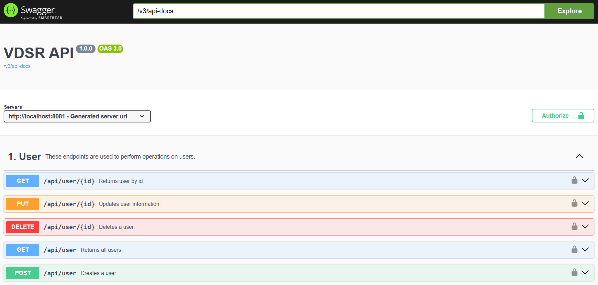

# VDSR Backend Project

## Requirements:
- Java 17
- PostgreSQL (I recommend using Docker for this)
- Maven

## How to run?
1. Modify `src/main/resources/application.properties`:
  ```yml
  # Datasource properties
  spring.datasource.url=jdbc:postgresql://localhost:5432/YOUR_DB_NAME
  spring.datasource.username=YOUR_DB_USER
  spring.datasource.password=YOUR_DB_PASSWORD
  spring.datasource.driverClassName=org.postgresql.Driver
  ```
2. Run `mvn exec:java` via terminal/console. Or just press `Build & Run` button in your IDE.

## How to see existing endpoints?
 - After starting the app you can access `http://localhost:8081/swagger-ui/index.html` to view the existing endpoints.
