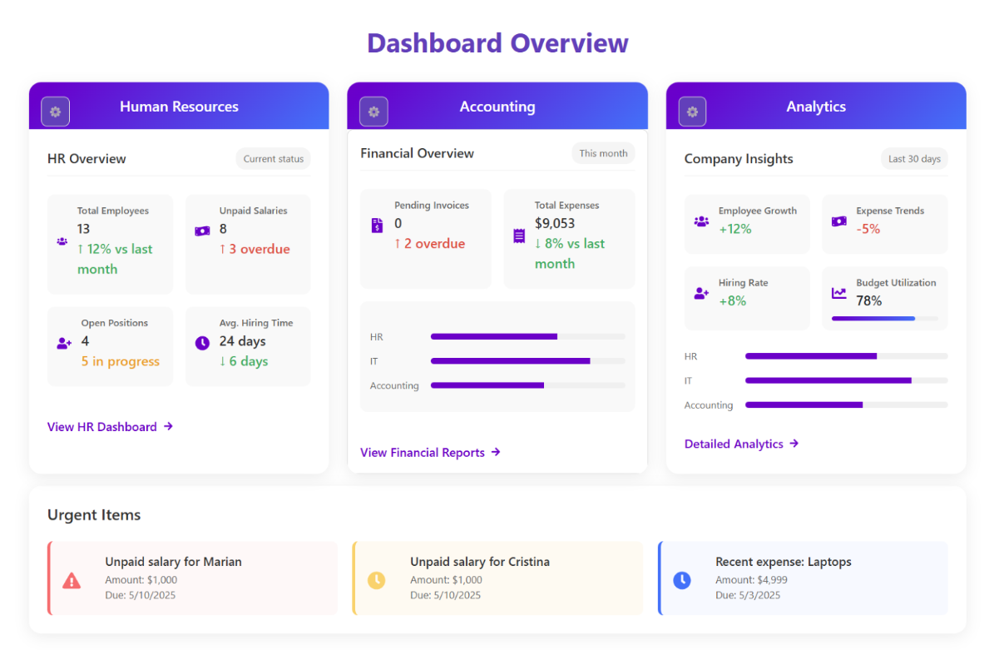
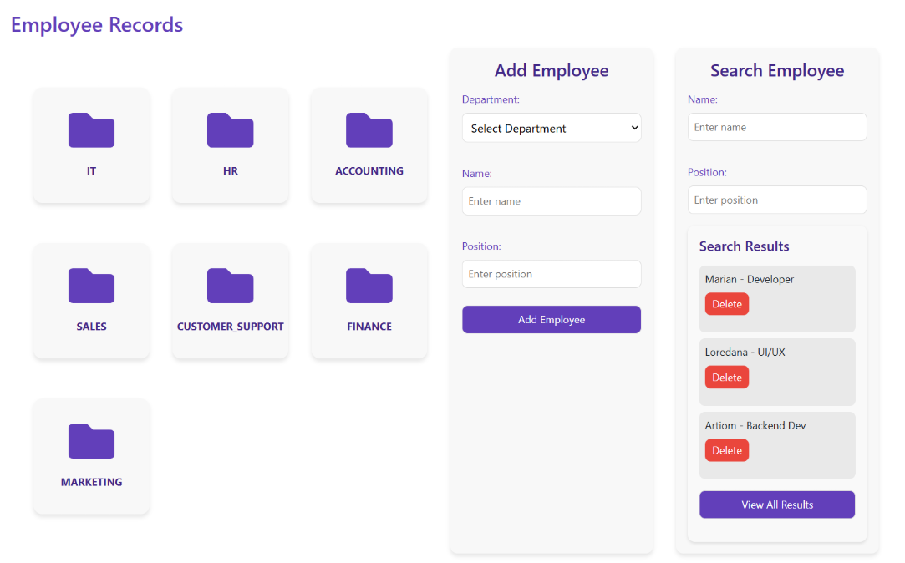
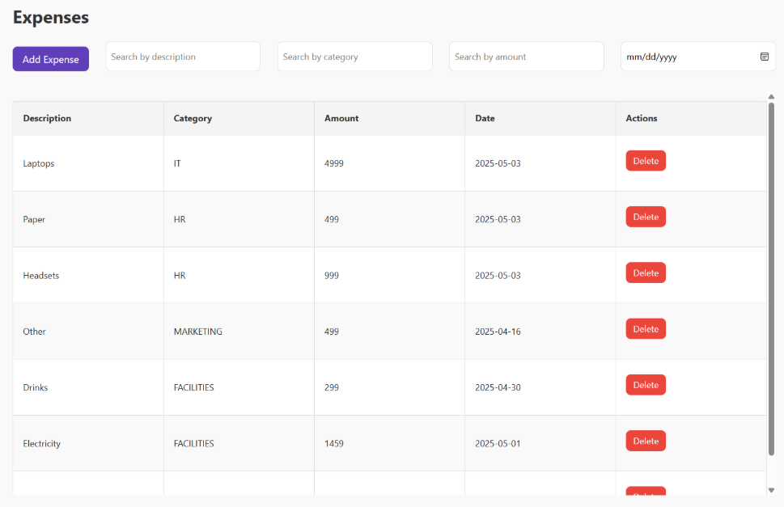

<h1 align="center">🚀 Cale Backend Project</h1>

<p align="center"><i>Bachelor’s Project: Company Management API using Spring Boot</i></p>

## 📘 Overview

This project is a **RESTful API** developed with **Spring Boot**, designed to manage core business operations within a company. It offers functionality to handle:

- 👨‍💼 Employee records  
- 📋 Project assignments  
- 💼 Job postings  
- 💰 Basic accounting tasks

The system is designed with **scalability**, **clean architecture**, and **modularity** in mind. It follows REST best practices and includes features like:

- 🔄 Full **CRUD** operations  
- 🔐 **Role-based access control**  
- 📦 Docker compatibility for simplified deployment

---

## 🖼️ Frontend Integration Preview

<p align="center"></p>
<br>
<p align="center"></p>
<br>
<p align="center"></p>

---

## ✅ Requirements

- ☕ Java 17  
- 🐘 PostgreSQL (Recommended: via Docker)  
- 📦 Maven  

---

## 🛠️ How to Run

1. Edit the `application.properties` file in `src/main/resources/`:

   ```properties
   # Database Configuration
   spring.datasource.url=jdbc:postgresql://localhost:5432/YOUR_DB_NAME
   spring.datasource.username=YOUR_DB_USER
   spring.datasource.password=YOUR_DB_PASSWORD
   spring.datasource.driverClassName=org.postgresql.Driver

   # JWT Configuration
   jwt.secret=YOUR_JWT_SECRET

   # Initial Owner Credentials
   owner.email=YOUR_OWNER_EMAIL
   owner.password=YOUR_OWNER_PASSWORD
   ```

   > 🔐 Generate a JWT secret easily using [jwtsecret.com](https://jwtsecret.com/)

2. Run the app using:

   - Terminal: `mvn exec:java`  
   - Or press `Build & Run` in your IDE  

   ✅ A default **Owner user** will be created using the email and password specified.

---

## 📂 View Available API Endpoints

Once the application is running, access the Swagger UI at:

📎 `http://localhost:8081/swagger-ui/index.html`

<p align="center"></p>

---

## 🐳 Run with Docker Compose

1. Create a `docker-compose.yml` file and configure as below:

   ```yaml
   services:
     vdsr-postgres:
       image: postgres:latest
       container_name: vdsr-postgres
       networks:
         - vdsr-network
       ports:
         - "5432:5432"
       environment:
         POSTGRES_USER: YOUR_POSTGRES_USERNAME
         POSTGRES_PASSWORD: YOUR_POSTGRES_PASSWORD
         POSTGRES_DB: vdsr
       healthcheck:
         test: ["CMD-SHELL", "pg_isready -U YOUR_POSTGRES_USER"]
         interval: 10s
         retries: 5
         start_period: 60s

     vdsr-backend:
       image: yashmerino/vdsr-backend:latest
       container_name: vdsr-backend
       networks:
         - vdsr-network
       ports:
         - "8081:8081"
       environment:
         SPRING_DATASOURCE_URL: jdbc:postgresql://vdsr-postgres:5432/vdsr
         SPRING_DATASOURCE_USERNAME: YOUR_POSTGRES_USERNAME
         SPRING_DATASOURCE_PASSWORD: YOUR_POSTGRES_PASSWORD
         owner.email: YOUR_OWNER_EMAIL
         owner.password: YOUR_OWNER_PASSWORD
         jwt.secret: YOUR_JWT_SECRET
       depends_on:
         vdsr-postgres:
           condition: service_healthy
       healthcheck:
         test: ["CMD", "curl", "--fail", "http://localhost:8081/actuator/health"]
         interval: 10s
         retries: 5
         start_period: 60s

   networks:
     vdsr-network:
       driver: bridge
   ```

2. Start the services:

   ```bash
   docker-compose up -d
   ```

---
